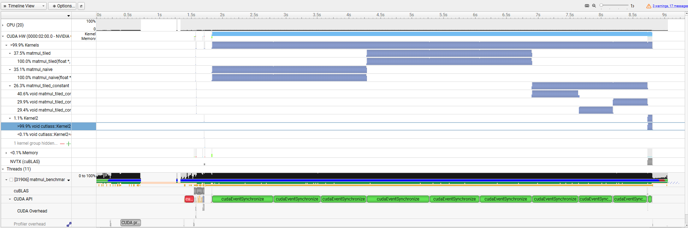

# CUDA-Accelerated Deep Learning Operators

A CUDA learning project that implements and optimizes common deep learning operators from scratch using FP32.

Test GPU: **NVIDIA GeForce RTX 5080 Laptop GPU**

## Matrix Multiplication

### Implementation

- **Naive CUDA:** one thread computes one output element directly from global memory.
- **Tiled Shared Memory:** `16 x 16` blocks cooperatively load tiles of `A` and `B` into dynamic shared memory.
- **Compile-Time Tiled:** uses the same tiling strategy with `matmul_tiled_constant<16>`, allowing the compiler to optimize loop bounds and indexing.
- **cuBLAS SGEMM:** used as the optimized library baseline.

### Benchmark

- Warm-up iterations: `10`
- Timed iterations: `500`
- Timing: CUDA Events
- Correctness: CPU reference, tested with `256 x 256 x 256`
- Metric: `GFLOPS = 2 × N × M × K / execution_time`

| Matrix Size | Naive (ms) | Dynamic Tiled (ms) | Compile-Time Tiled (ms) | Compile-Time GFLOPS | cuBLAS (ms) | cuBLAS GFLOPS |
|---:|---:|---:|---:|---:|---:|---:|
| 512 | 0.130372 | 0.144321 | 0.097749 | 2746.16 | 0.030295 | 8860.86 |
| 1024 | 0.953866 | 0.987538 | 0.649937 | 3304.14 | 0.121371 | 17693.52 |
| 2048 | 7.251064 | 7.667174 | 5.229117 | 3285.42 | 0.772498 | 22239.38 |
| 4096 | 68.344002 | 71.486374 | 50.667389 | 2712.57 | 6.628629 | 20734.15 |

The compile-time tiled kernel is the fastest custom implementation, reaching a **1.33x–1.47x speedup** over the naive kernel. The dynamic tiled version is slightly slower in these benchmarks, showing that shared-memory tiling alone does not guarantee a speedup. cuBLAS remains **3.23x–7.64x faster** than the best custom kernel.

### Nsight Profiling

Nsight Systems was used to inspect the execution timeline of the `2048 x 2048 x 2048` matrix multiplication benchmark.

```bash
nsys profile \
    --trace=cuda,cublas \
    --stats=true \
    -o profiles/matmul_systems \
    ./build/matmul_benchmark 2048 2048 2048 results/nsys_run.csv
```



The timeline shows that GPU activity is dominated by the matrix multiplication kernels, while host-device memory transfers account for only a small fraction of the captured GPU time. Nsight Compute was also used to inspect the `16 x 16` naive, runtime-tiled, and compile-time-tiled kernels. The compile-time kernel had the shortest profiled duration and used `37` registers per thread, compared with `40` for the other two kernels, matching the performance ordering measured with CUDA Events.

---

## ReLU

### Implementation

Each thread processes one element:

```cpp
y[i] = max(x[i], 0)
```

The kernel uses contiguous global-memory accesses and `256` threads per block. ReLU performs little computation and is primarily limited by memory bandwidth.

### Benchmark

- Warm-up iterations: `10`
- Timed iterations: `500`
- Timing: CUDA Events
- Correctness: CPU reference

| Elements | Time (ms) |
|---:|---:|
| 1,048,576 | 0.007443 |
| 4,194,304 | 0.019389 |
| 16,777,216 | 0.176785 |
| 67,108,864 | 0.739134 |

For large inputs, execution time scales approximately linearly with the number of elements, confirming that the kernel is memory-bandwidth-bound.

---

## Row-Wise Softmax

### Implementation

One CUDA block processes one row. Each thread handles multiple columns with a strided loop, allowing the same kernel to support different row widths.

The numerically stable Softmax is computed in three stages:

1. Find the row maximum.
2. Compute and reduce `exp(x - max)`.
3. Divide each stored exponential value by the row sum.

Two reduction kernels were implemented:

- **Shared-Memory Reduction:** tree reduction using shared memory and block-wide synchronization.
- **Warp-Shuffle Reduction:** uses `__shfl_down_sync` inside each warp and shared memory only to combine per-warp results.

The exponential values are temporarily stored in the output buffer so that `expf` is not computed twice.

### Benchmark

- Rows: `4096`
- Threads per block: `128`
- Warm-up iterations: `10`
- Timed iterations: `500`
- Timing: CUDA Events
- Correctness: CPU reference

| Cols | Shared Memory (ms) | Warp Shuffle (ms) | Speedup |
|---:|---:|---:|---:|
| 32 | 0.015420 | 0.011873 | 1.30x |
| 64 | 0.015545 | 0.011646 | 1.33x |
| 100 | 0.018068 | 0.011418 | 1.58x |
| 128 | 0.018029 | 0.011602 | 1.55x |
| 256 | 0.018049 | 0.013966 | 1.29x |
| 512 | 0.021439 | 0.017691 | 1.21x |
| 1024 | 0.032033 | 0.030555 | 1.05x |
| 2048 | 0.088949 | 0.088761 | 1.00x |
| 4096 | 0.175801 | 0.175623 | 1.00x |

Warp Shuffle provides the largest improvement for short rows, where reduction and synchronization are a significant part of total execution time. For wide rows, `expf`, division, and global-memory traffic dominate, so the two reduction methods perform similarly.

---

## Row-Wise LayerNorm

### Implementation

One CUDA block processes one row, and each thread handles multiple columns with a strided loop. The kernel:

1. Reduces the row sum to compute the mean.
2. Reduces squared deviations to compute the variance.
3. Normalizes the row and applies per-column `gamma` and `beta`.

Both reductions use warp shuffle with `__shfl_down_sync`, while shared memory stores only one partial result per warp. `rsqrtf(variance + eps)` is computed once per row and reused during normalization.

### Benchmark

- Rows: `4096`
- Threads per block: `128`
- Warm-up iterations: `10`
- Timed iterations: `500`
- Timing: CUDA Events
- Correctness: CPU reference

| Cols | Time (ms) |
|---:|---:|
| 128 | 0.011318 |
| 256 | 0.013329 |
| 512 | 0.015657 |
| 1024 | 0.023196 |
| 2048 | 0.078079 |
| 4096 | 0.199568 |

Runtime grows slowly for short rows because block scheduling and reduction overhead dominate. For wider rows, per-element memory accesses and arithmetic become the main cost, causing execution time to scale more strongly with the number of columns.

---

## Custom CUDA vs PyTorch

### Benchmark Setup

- Data type: `FP32`
- Device: `NVIDIA GeForce RTX 5080 Laptop GPU`
- Warm-up iterations: `20`
- Timed iterations: `500`
- Timing: CUDA Events
- Execution mode: `torch.inference_mode()`
- Ratio: `Custom / PyTorch`

### ReLU

- Input shape: `4096 x Cols`

| Cols | Custom CUDA (ms) | PyTorch (ms) | Custom / PyTorch |
|---:|---:|---:|---:|
| 128 | 0.008300 | 0.009526 | 0.87 |
| 256 | 0.010478 | 0.009314 | 1.12 |
| 512 | 0.011841 | 0.010248 | 1.16 |
| 1024 | 0.019338 | 0.013215 | 1.46 |

### Softmax

- Input shape: `4096 x Cols`
- Reduction dimension: last dimension

| Cols | Custom CUDA (ms) | PyTorch (ms) | Custom / PyTorch |
|---:|---:|---:|---:|
| 128 | 0.015453 | 0.009441 | 1.64 |
| 256 | 0.019261 | 0.010911 | 1.77 |
| 512 | 0.025043 | 0.012420 | 2.02 |
| 1024 | 0.030190 | 0.019078 | 1.58 |

### LayerNorm

- Input shape: `4096 x Cols`
- Normalized dimension: last dimension
- Affine parameters: `gamma` and `beta`
- Epsilon: `1e-5`

| Cols | Custom CUDA (ms) | PyTorch (ms) | Custom / PyTorch |
|---:|---:|---:|---:|
| 128 | 0.017943 | 0.019689 | 0.91 |
| 256 | 0.022046 | 0.019582 | 1.13 |
| 512 | 0.026577 | 0.024804 | 1.07 |
| 1024 | 0.029140 | 0.031687 | 0.92 |

### Matrix Multiplication

- Input matrices: `N x N`
- Output matrix: `N x N`

| N | Custom CUDA (ms) | PyTorch (ms) | Custom / PyTorch |
|---:|---:|---:|---:|
| 512 | 0.098758 | 0.030126 | 3.28 |
| 1024 | 0.716952 | 0.129381 | 5.54 |
| 2048 | 5.361661 | 0.799121 | 6.71 |
| 4096 | 49.964867 | 6.677155 | 7.48 |

---

## Build and Run

### Matrix Multiplication

```bash
nvcc -Iinclude \
    src/matmul_naive.cu \
    src/matmul_tiled.cu \
    src/matmul_tiled_constant.cu \
    benchmarks/matmul_benchmark.cu \
    -lcublas \
    -o matmul_benchmark

./matmul_benchmark
```

### ReLU

```bash
nvcc -Iinclude \
    src/relu.cu \
    benchmarks/relu_benchmark.cu \
    -o relu_benchmark

./relu_benchmark
```

### Softmax

```bash
nvcc -Iinclude \
    src/softmax.cu \
    benchmarks/softmax_benchmark.cu \
    -o softmax_benchmark

./softmax_benchmark
```

### LayerNorm

```bash
nvcc -Iinclude \
    src/layernorm.cu \
    benchmarks/layernorm_benchmark.cu \
    -o layernorm_benchmark

./layernorm_benchmark
```